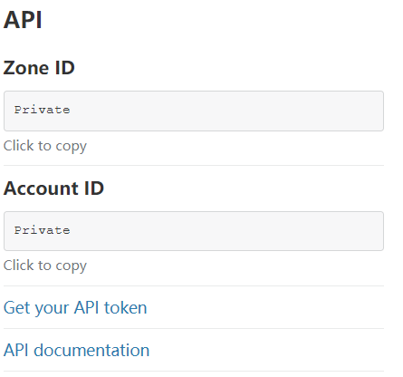

# 自动修改cf域名


### 1.获取Cloudflare Global API 令牌

任何 API 操作都需要提供账号邮箱和 API 令牌用来验证身份。

1. 前往 [Cloudflare API 令牌](https://dash.cloudflare.com/profile/api-tokens)页面。
2. 点击 `Global API Key` 后面的 **\[查看]** 按钮。
3. 输入 Cloudflare 账号的**密码**，并通过人机验证。
4. 点击复制 **API 令牌**并保存好。

[](https://user-images.githubusercontent.com/54703944/105816499-57cff100-5fef-11eb-9059-c22d91782d4e.png)[](https://user-images.githubusercontent.com/54703944/105816487-56062d80-5fef-11eb-969d-4de8b3f49491.png)[](https://user-images.githubusercontent.com/54703944/105816494-57375a80-5fef-11eb-8148-8c1fcb7d8865.png)

### 2.获取域名的Zone id

域名概述界面的Zone id



### 3.使用API获取DNS记录的ID(获取子域名ID) <a href="#shi-yong-api-huo-qu-dns-ji-lu-de-id" id="shi-yong-api-huo-qu-dns-ji-lu-de-id"></a>

```
curl -sSX GET "https://api.cloudflare.com/client/v4/zones/域名的zoneid/dns_records?type=A&name=子域名" -H "X-Auth-Email:注册邮箱" -H "X-Auth-Key:CF的API令牌" -H "Content-Type: application/json"|jq ".result[].id"|sed "s/\"//g"
```

命令实例：

curl -sSX GET "https://api.cloudflare.com/client/v4/zones/99e0163a23edc1cc0f56789c0ae12345/dns\_records?type=A\&name=sg999.xgh1.com" -H "X-Auth-Email:lizi@gmail.com" -H "X-Auth-Key:3bb1226f1234e6eb7c7796185d8925b123456" -H "Content-Type: application/json"|jq ".result\[].id"|sed "s/"//g"

回显实例：

c1010000d55b132f3c9d3aaa668f1292

### 4.修改子域名

You cannot use this API for domains with a .cf, .ga, .gq, .ml, or .tk TLD (top-level domain)

如上，cloudflare不支持上述域名



```
curl -X PUT "https://api.cloudflare.com/client/v4/zones/域名zoneid值/dns_records/子域名DNS记录id值" -H "X-Auth-Key: CF账号API令牌" -H "X-Auth-Email: CF账号注册邮箱" -H "Content-Type: application/json" --data '{"type":"A","name":"子域名完整域名","content":"修改为该IP值","ttl":1,"proxied":false}'
```

命令实例：

curl -X PUT "https://api.cloudflare.com/client/v4/zones/<mark style="color:red;">域名zoneid值</mark>/dns\_records/<mark style="color:red;">子域名DNS记录id值</mark>" -H "X-Auth-Key: <mark style="color:red;">CF账号API令牌</mark>" -H "X-Auth-Email: <mark style="color:red;">CF账号注册邮箱</mark>" -H "Content-Type: application/json" --data '{"type":"A","name":"<mark style="color:red;">子域名完整域名</mark>","content":"<mark style="color:red;">修改为该IP值</mark>","ttl":1,"proxied":false}'

回显实例：

{"result":{"id":"xxxx","zone\_id":"xxxx","zone\_name":"xxxx","name":"xxxx","type":"A","content":"xxxx","proxiable":false,"proxied":false,"ttl":1,"locked":false,"meta":{"auto\_added":false,"managed\_by\_apps":false,"managed\_by\_argo\_tunnel":false,"source":"primary"},"comment":null,"tags":\[],"created\_on":"2023-01-13T06:57:29.060266Z","modified\_on":"2023-01-13T08:43:47.176831Z"},<mark style="color:blue;background-color:red;">"success":true</mark>,"errors":\[],"messages":\[]}



```
// Some code
```

命令实例：

curl -X PUT "https://api.cloudflare.com/client/v4/zones/7aaf1fbbf6296d6a70a20392244cfac0/dns\_records/676bd05029c2b24712c41205ae85813f" -H "X-Auth-Key: 3aa9e26f7500e6eb7c7796185d2505b22ecad" -H "X-Auth-Email: cgkings@gmail.com" -H "Content-Type: application/json" --data "{"type":"A","name":"test.00544.tech","content":"4.4.4.4","ttl":1,"proxied":false}"




